# 在vscode上搭建stm32开发环境

## 一、写在前面

---

看到网上还有很多在为keil的各种bug而烦恼为它的过时的ui而吐槽的，在这里分享一下我已经用了一年多的基于vscode的stm32开发环境.

---
!!!本方法无需在下载各种插件后还要进行层层配置，也不用手写各种json文件！！！

---

先说下整体感受，keil的debug功能的强大不管是stm32cubeide还是本文用到的cortex-debug都无法比拟，用vscode开发的理由无非是为了它的代码补全以及cursor和trae的自动补全，keil不能接入AI，在开发效率上就已经完败了。

因此接下来将介绍stm32cubemx+stm32cubeclt+vscode(cursor,trae)+vscode的扩展stm32 vscode extensions+stlink调试器搭建而成的stm32全套开发环境以及开发流程。

---

## 二、准备工作

安装好上面提到的软件，这里提供cubeclt的下载链接[stm32cubeclt]([text](https://download.csdn.net/download/weixin_41958698/90073832?spm=1001.2014.3001.5503))

如果用的是trae，插件市场没办法下载stm32 vscode extensions, 这里提供该插件下载链接[stm32 vscode extensions]([text](https://download.csdn.net/download/weixin_41958698/90455550?spm=1001.2014.3001.5503))  

必要插件：

1. CMake
2. CMake Tools
3. C/C++
4. Cortex-Debug
5. stm32 vscode extensions

其他推荐插件：

1. Binary Viewer
2. cland
3. Hex Editor
4. LinkerScript

## 三、开发流程

以stm32h723zgt6为例，用cubemx建立一个最简单的工程来演示。

### 1、cubemx生成cmake工程

cubemx简单配置一下时钟源和时钟树，再选择tim6做系统时钟时基，其他不做任何额外的配置，直奔project manager界面。
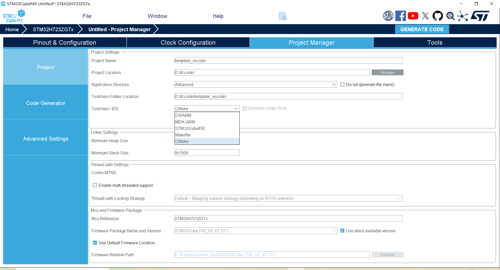

选择cmake编译工具即可，点击生成代码。

### 2、配置stm32 vscode extensions

在设置中搜索stm32，配置cubemx和cubeclt的路径：

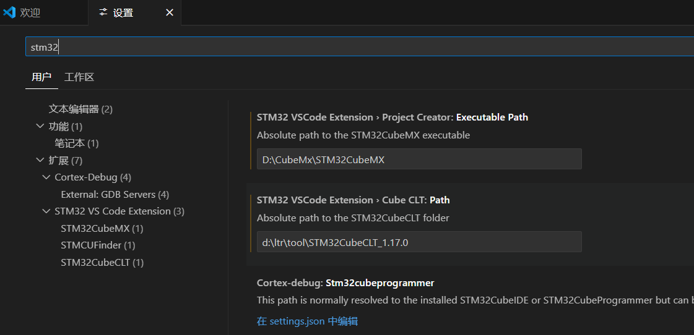

在侧边栏找到stm32 vscode extensions， 点击import cmake projects。

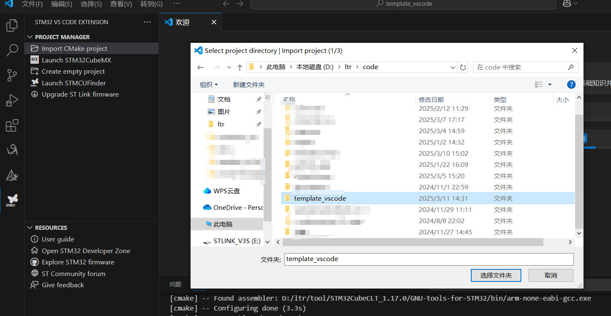

选择你的工程文件夹，点击import project

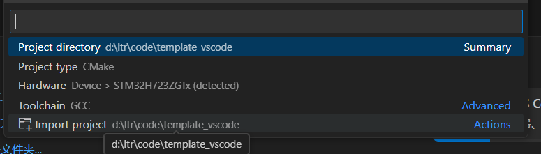

这时你会发现工程中多了一个文件夹
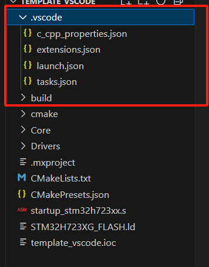

这个文件夹的内容包括了对本工程编程语言格式的规定，cortex-debug调试的配置，stlink的链接，编译任务和调试任务的脚本都给你自动写好了。

### 3、cmake编译工程

需安装cmake和cmake tools插件。

点击左边栏cmake插件，点击配置
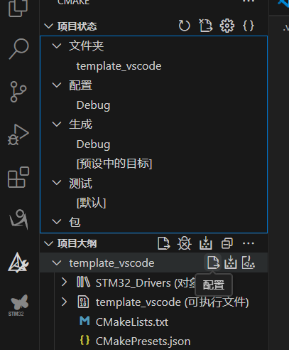

每次添加完新的文件都需要重新配置，在cmakelists.txt中编写好规则之后cmake会帮你处理好依赖关系。

配置没问题后点击生成：
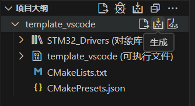

编译结果如下：
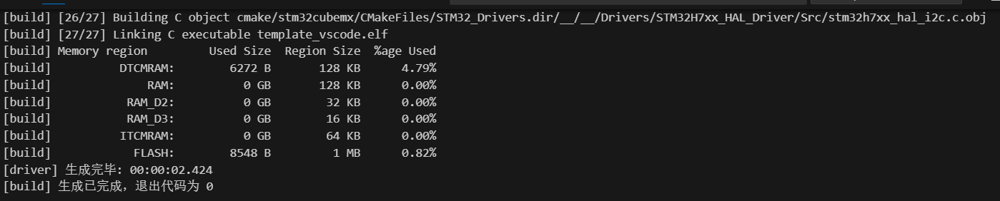

到这里stm32工程的编译工作已经完成了，vscode的便捷相信只要用过的都很难再回去keil了，没有用过的也可以立刻编写一个简单的程序试试vscode丝滑的代码补全和跳转和文件搜索等功能。

在这里我强烈推荐使用cursor代替vscode，cursor完全继承vscode并且内嵌AI编辑功能，vscode虽然也能通过GitHub Copilot实现类似功能但在补全代码和生成完整项目上远不如cursor。Cursor有一个月试用期，用过之后你会发现从此编程再也离不开AI了。

如果cursor到期了不愿意续费，也不愿意折腾卡bug，可以考虑使用字节的trae，也是能同步vscode的所有设置，可以无缝衔接，功能和cursor类似但功能性不如cursor好用，但依然是cursor之下最好的替代品，因为他免费。

### 4、下载和调试

在cmake插件页面，点击运行任务，如图所示下载程序到stm32：
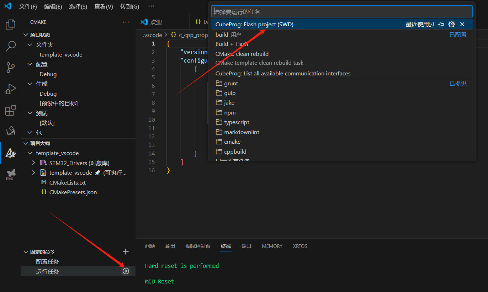

输出以下信息后则说明下载成功：
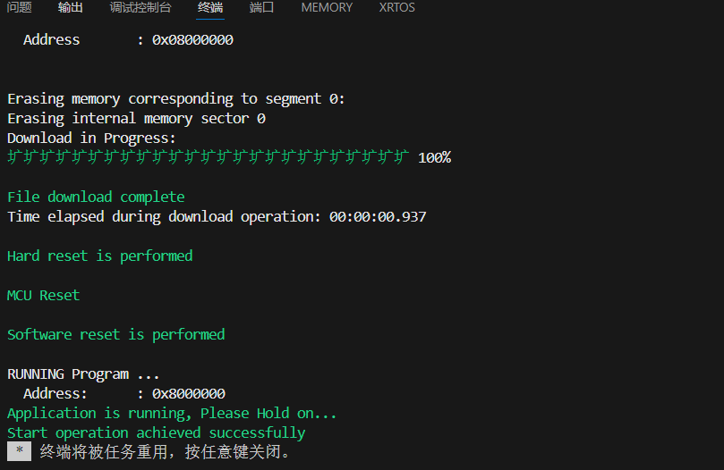

调试也会自动下载程序：
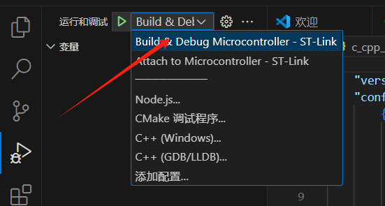

点击开始调试：
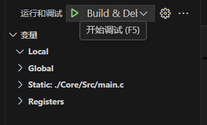

然后会出现这个框，点击继续或f5程序就开始运行：
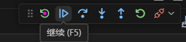

可以在main的循环中加一个计数，体验断点和变量监视功能：
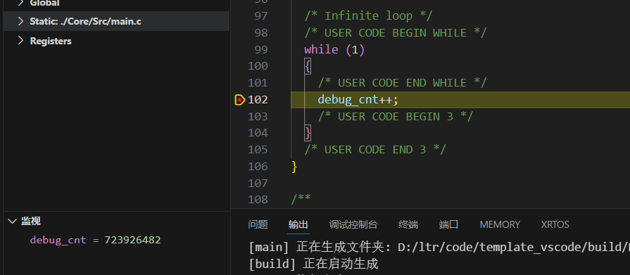

为什么开头说keil是最好的debug软件，因为vscode想要看运行中的变量需要暂停，而keil只需要将变量设置为全局变量即可，当然，对于现在的我来说，keil的这个优点依然无法让我忽视他别的缺点。

---

## 四、The End

即使排除在编程上的便利性，相比于keil的繁琐配置，使用cmake进行工程管理很明显要方便很多，在移植第三方库时也不用这里点点添加源文件那里点点添加头文件，很直白很直观。

mac os也可以使用本方法在macbook上进行stm32开发，下面提供mac版本的cubemx和cubeclt，祝大家有更省心的工作体验：

[cubemx]([text](https://download.csdn.net/download/weixin_41958698/90456818?spm=1001.2014.3001.5503))

[cubeclt]([text](https://download.csdn.net/download/weixin_41958698/90455295?spm=1001.2014.3001.5503))

我的github上也开源了一个基于threadx和netxduo的tcp服务器项目，用的开发环境就是本文所介绍的：
[stm32h723zgt6-nx-tx]([text](https://github.com/newtonltr/stm32h723zgt6-nx-tx))